# WYD Web

Reimplementação do cliente clássico de **With Your Destiny** para o navegador,
escrita do zero em TypeScript e Three.js. O cliente clássico/decompilado é usado
como referência de formatos e comportamento; o código web antigo não é
reutilizado.

> Projeto em desenvolvimento e atualmente offline: rede e servidor ainda não
> fazem parte deste recorte. Consulte a [fila canônica](PENDENCIAS.md) para ver o
> que está homologado e o que ainda é provisório.

Documentação de arquitetura:

- [Auditoria Three.js e cobertura clássica](docs/auditoria-threejs-cobertura.md)
- [Guia do futuro servidor multiplayer](docs/guia-servidor-multiplayer.md)
- [Estimativa para substituir os assets clássicos](docs/estimativa-substituicao-assets.md)
- [Memória técnica do projeto](MEMORIA_PROJETO.md)

## Estado atual

- 111 Fields importados, nomeados, conectados e carregados dinamicamente.
- Terreno, objetos, colisão, pontes, água, efeitos ambientais e minimapa.
- TransKnight, Foema, BeastMaster e Huntress com visuais, armas e skills por classe.
- Huntress com Mulher Kalintz, Skytalos Ancient +15 animado e Griupan.
- Extração e Alquimia da Huntress com seleção de item, confirmação e painel
  `Mixlist.bin`; resultados econômicos continuam reservados ao servidor.
- Toxina de Serpente mantém a exigência clássica de garras `WTYPE 41` e
  rejeita corretamente o Skytalos `WTYPE 101` antes de consumir mana.
- Oito evocações naturais do BeastMaster (10 por uso) e as cinco
  transformações clássicas com rig e animações próprios.
- 14 montarias clássicas nível 120, incluindo Unicórnio e Grifo.
- NPCs e monstros com animação, autonomia, separação, combate, morte e respawn.
- Cemitério e Cabuncle com contador sincronizado para o próximo reset de 10
  minutos; os monstros dessas quests só adquirem o player dentro da área.
- Drops materializados no mundo, coleta por proximidade e nomes globais opcionais.
- Bolsa e cargo respeitam o `EF_GRID` clássico para itens de `1×1` até `2×4`.
- Movimento por WASD/clique, câmera clássica, zoom amplo e modo G.
- C.C clássico com modos físico, mágico e suporte, arco, dano/crítico, skills e
  buffs da Huntress.
- Mestre Carb com interação instantânea e os estados/ícones dos 32 buffs de
  classe/master do `SkillData.bin` renovados por 15 minutos.
- HUD clássico e inventário 7.54 com quatro bolsas, drag/drop, equipamento e
  preview 3D por clique, além do catálogo de skills e seletor de mapas.
- Trilha clássica roteada por mapa/cidade e catálogo lazy de 333 SFX. A música
  começa desligada e pode ser alternada com `M`; SFX de ataque, skill, impacto,
  level up e coleta continuam independentes. Passos respeitam o tipo do piso;
  monstros/NPCs usam os IDs de suas ações no `AniSound4.txt`, e cachoeiras,
  chuva local e objetos ambientais possuem loops atenuados por distância.

## Capturas do build atual

| Armia, HUD, minimapa e seletor | Huntress, Skytalos Ancient e Griupan |
| --- | --- |
| 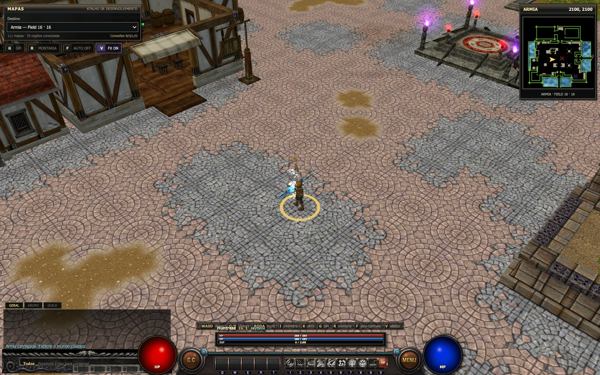 | 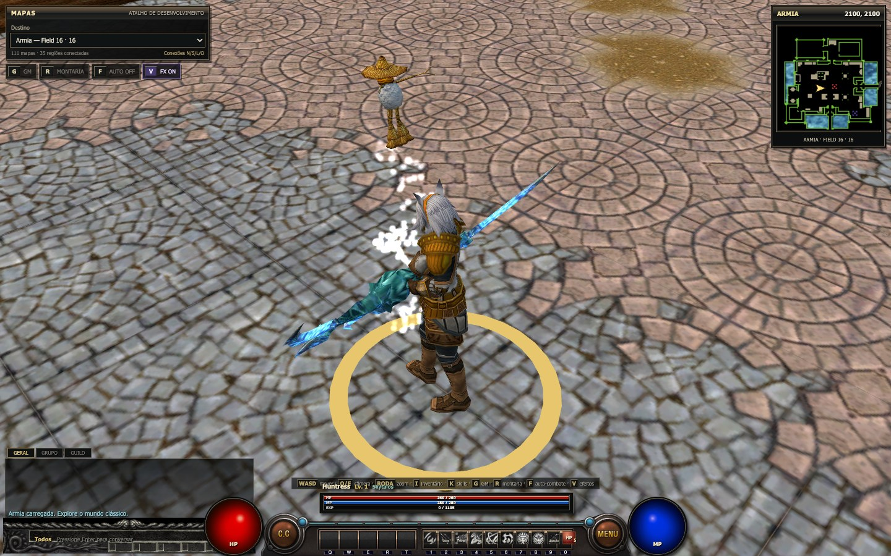 |

| Inventário, trajes e montarias | Grifo nível 120 |
| --- | --- |
| 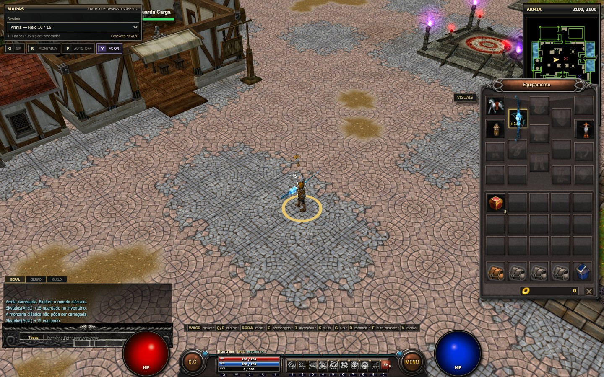 | 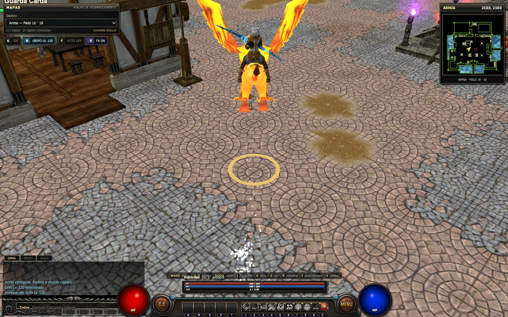 |

| Buff persistente da Huntress | Catálogo clássico de skills |
| --- | --- |
| 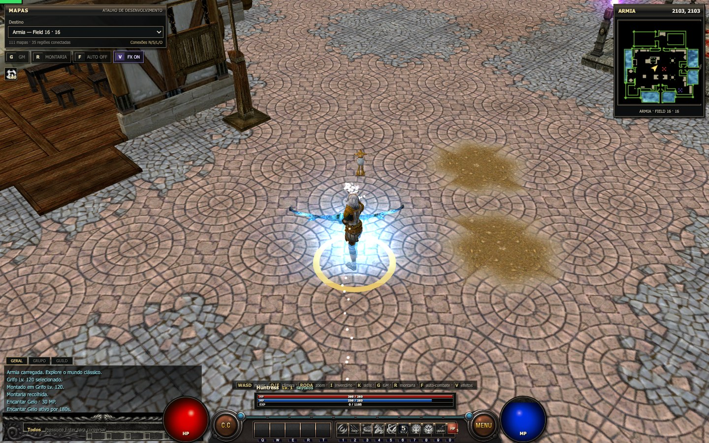 | 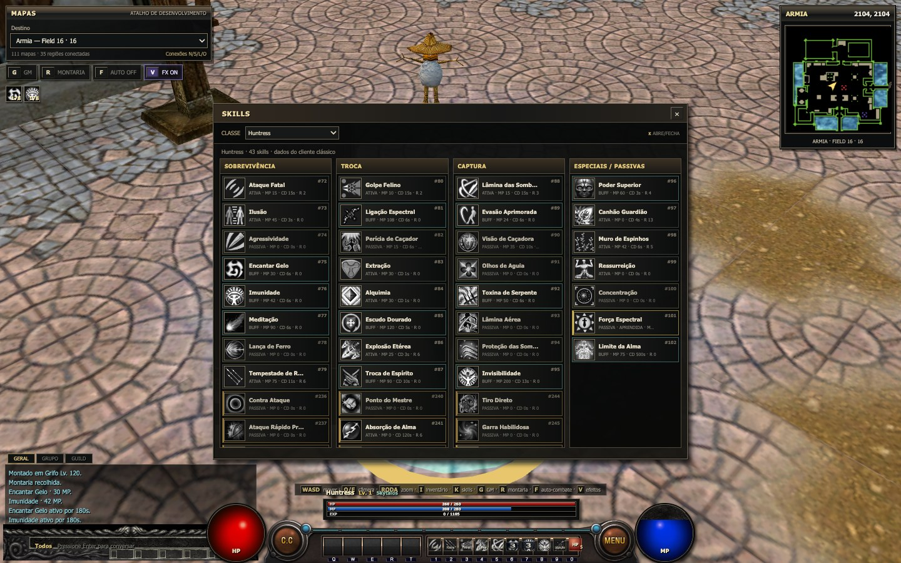 |

### As quatro classes clássicas

| TransKnight com Machado Gaoth | Foema com Dordje |
| --- | --- |
| 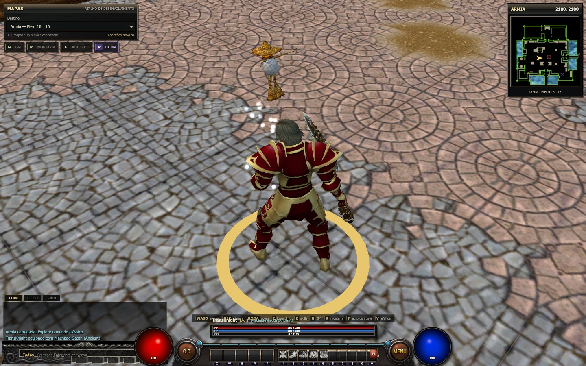 | 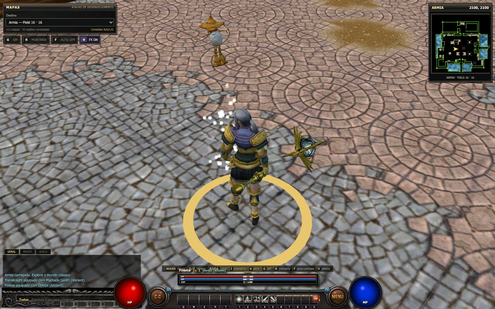 |

| BeastMaster com Martelo Kaumodaki | Huntress com Skytalos |
| --- | --- |
| 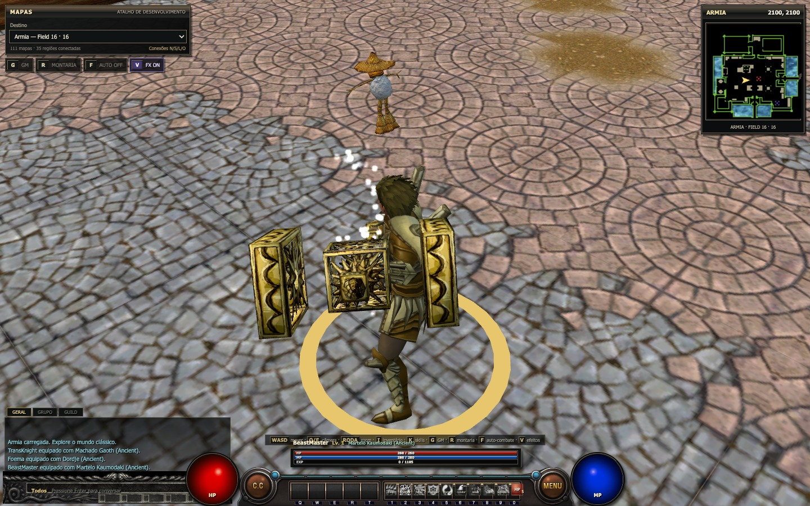 | 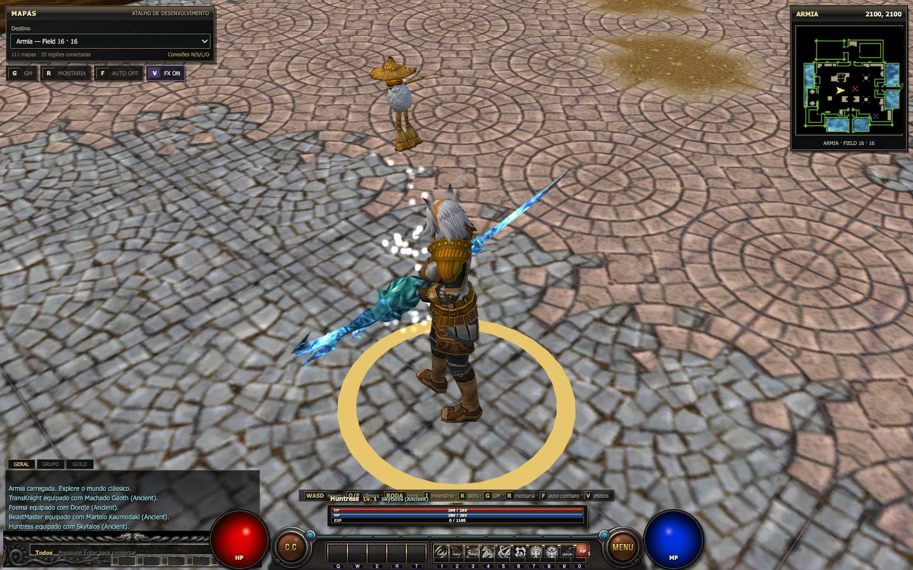 |

### Evocações do BeastMaster

O slot `9` da barra evoca o **Grande Tigre**. Assim como as demais evocações
naturais do BeastMaster, cada uso cria uma formação com 10 criaturas.

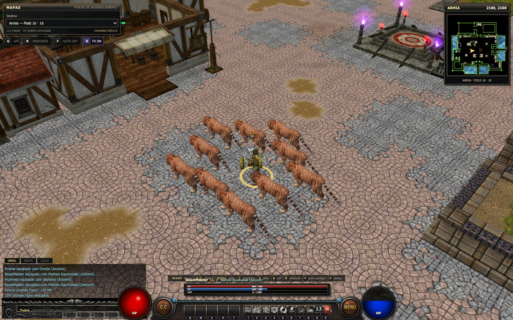

| Criaturas no mundo aberto | Visão geral de Armia |
| --- | --- |
| 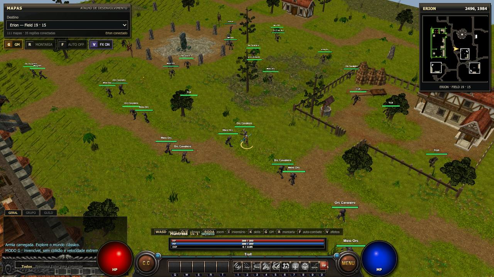 | 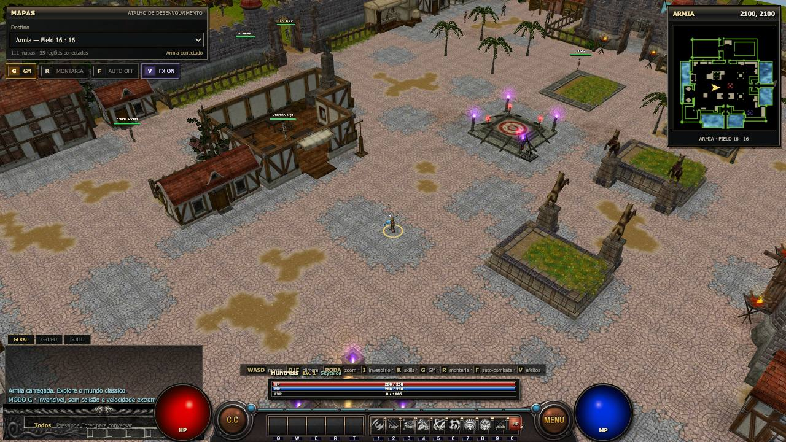 |

Uma captura real foi gerada para cada Field disponível. Veja a
**[galeria completa dos 111 mapas](docs/screenshots/maps/README.md)**.

## Rodando do zero

### Requisitos

- [Git](https://git-scm.com/).
- [Bun 1.x](https://bun.sh/docs/installation) — este projeto não usa npm.
- Navegador desktop atual com WebGL 2 e aceleração de hardware habilitada.
- Aproximadamente 500 MB livres para repositório, dependências e build.

### 1. Clonar e instalar

```bash
git clone git@github.com:acgfbr/wyd-client.git
cd wyd-client
bun install --frozen-lockfile
```

O repositório atual já inclui `public/game-data/classic`. Confirme que o pacote
de dados veio no clone:

```bash
test -f public/game-data/classic/manifest.json && echo "assets OK"
```

### 2. Iniciar o jogo

```bash
bun run dev
```

Abra [http://localhost:5173](http://localhost:5173). O jogo começa em Armia, na
coordenada `2100, 2100`. Se a porta estiver ocupada, o Vite mostrará no terminal
a próxima porta utilizada.

### 3. Validar um build de produção

```bash
bun run build
bun run preview
```

O build é escrito em `dist/`; o preview normalmente abre em
[http://localhost:4173](http://localhost:4173).

### Proteção do build web

O build de produção não publica source maps, remove comentários legais,
`debugger` e chamadas a `console.debug`, e aplica a minificação completa do
esbuild a identificadores, sintaxe e espaços. Os bundles gerados usam somente
hashes nos nomes; `console.warn` e `console.error` permanecem disponíveis para
diagnóstico de falhas reais em dispositivos e assets.

Isso dificulta leitura casual e engenharia reversa, mas não transforma código
executado no navegador em segredo: o usuário sempre recebe o JavaScript e as
regras necessárias para rodar o jogo. Chaves privadas, validações autoritativas,
economia, drops e decisões anticheat precisam permanecer no servidor.

## Recriando os assets a partir do cliente clássico

Esta etapa é opcional quando `public/game-data/classic` já veio no clone. Use-a
para reconstruir o pacote a partir dos seus próprios arquivos do cliente:

```text
Origem/
├── Env/
├── Effect/
├── mesh/
├── UI/
├── NUI/
├── object.bin
├── ItemList.bin
├── ItemPrice.bin
├── Itemname.txt
├── SkillData.bin
└── AniSound4.txt

tools/data/
├── NPCGener.txt
└── npcdb/
```

Execute o importador único passando caminhos absolutos:

```bash
bun run import:all -- \
  "/caminho/para/Origem" \
  "/caminho/para/tools/data"
```

Sem argumentos, ele procura `../tjs/Origem` e `../tjs/tools/data`, relativos a
este repositório:

```bash
bun run import:all
```

O comando executa, em ordem, os importadores de mundo/criaturas, personagem,
skills, UI, comércio e áudio. Para depuração, eles também podem ser chamados
separadamente:

```bash
bun run import:classic -- "/caminho/para/Origem" "/caminho/para/tools/data"
bun run import:player -- "/caminho/para/Origem"
bun run import:skills -- "/caminho/para/Origem"
bun run import:ui -- "/caminho/para/Origem"
bun run import:commerce -- "/caminho/para/Origem" "/caminho/para/tools/data"
bun run import:audio -- "/caminho/para/Origem" "/caminho/para/wyd_extracted/AudioClip"
```

O segundo caminho do importador de áudio é opcional e só aceita fallback com
o mesmo nome de arquivo. No corpus atual ele recupera `mguardatt.wav` do
cliente mobile; aproximações como `weath03-A/B` não substituem referências
desktop diferentes.

`import:commerce` gera
`public/game-data/classic/commerce/catalog.json` a partir dos 6.500 registros
de `ItemList.bin`, dos overrides de `ItemPrice.bin` e dos 27 slots comerciais
de `Carry` nos templates de `npcdb` referenciados por `NPCGener.txt`. Esse
catálogo é estático e somente leitura. Neste corpus, os campos finais de
`ItemList.bin` usam `unique@132`, `reserved@134`, `position@136`, `extra@138`,
`link@140` e `grade@142`; esses offsets alimentam os tooltips clássicos de
inventário/equipamento/cargo/loja com requisitos, efeitos fixos, três
adicionais de instância, refinação e bônus Ancient. Compra, venda, saldo, Tax e
qualquer mutação de inventário continuam sendo responsabilidades do futuro
servidor.

## Controles

| Entrada | Ação |
| --- | --- |
| `WASD` / setas | Mover o personagem |
| Clique esquerdo | Caminhar até o ponto ou selecionar um alvo |
| Esquerdo mantido | Atualizar continuamente o destino |
| Esquerdo + direito | Avançar na direção da câmera |
| Direito arrastado | Girar a câmera |
| Roda do mouse | Zoom de `3.5` a `180` unidades |
| `Q` / `E` | Girar a câmera pelo teclado |
| `G` | Modo GM: velocidade extrema, invencibilidade e sem colisão |
| `R` | Montar/desmontar |
| `F` | Alternar C.C: desligado → físico → mágico → suporte |
| Clique em `C.C` | Abrir/fechar a caixa clássica de configuração |
| `Espaço` | Coletar o drop materializado mais próximo dentro do alcance offline ampliado |
| `Z` | Ligar/desligar os nomes de todos os drops |
| `1`–`9` | Usar skills da barra |
| `I` | Abrir/fechar inventário, trajes e montarias |
| Clique em um item | Prender o preview 3D ao cursor; outro clique solta/move/equipa |
| Arrastar um item | Mover/trocar na bolsa ou equipar/desequipar |
| Duplo clique em um item | Usar consumível ou equipar/desequipar |
| Abas de bolsa | Alternar entre as quatro páginas de 15 espaços |
| `K` | Abrir/fechar catálogo de skills |
| `V` | Ligar/desligar todos os efeitos visuais |
| `M` | Ligar/desligar somente a música (desligada por padrão) |
| `B` | Ligar/desligar todos os SFX: ataque, skill, buff, passos e ambiente |

### Loot offline

Enquanto não há servidor autoritativo, o fallback local pode materializar
**Poção de HP** (`#400`), **Poção de MP** (`#405`), **Poeira de Oriharucon**
(`#412`) e **Poeira de Lactolerium** (`#413`). As probabilidades e a tabela de
drop são mocks exclusivos do modo offline; o servidor deverá substituí-las.
Os quatro itens são agrupáveis em pilhas de até 50 unidades: uma coleta do chão
completa primeiro uma pilha existente, e soltar uma pilha sobre outra no
inventário também as combina. Para reduzir falhas de aproximação, a coleta web
aceita até três células e procura um ponto caminhável ao redor do item, mantendo
a validação de colisão e altura para não atravessar paredes ou pisos de pontes.

### Caixa C.C

O clique no botão redondo `C.C` apenas abre ou fecha a caixa original de
`120×30`; o primeiro ícone alterna o modo. Os outros três controles ajustam a
recuperação automática de HP/MP, o limite reservado à montaria e a política de
movimento (contínua, posição fixa ou parada). Os ícones são crops reais do
atlas clássico `main.wyt` importado como `main.png`.

- Físico procura hostis próximos e usa o ataque básico.
- Mágico usa somente as skills ofensivas selecionadas na extensão da caixa,
  respeitando a ordem, mana, cooldown e alcance, sem cair em ataque básico.
- Suporte mantém buffs/evocações e recuperação, sem atacar.
- `F` altera o mesmo estado mostrado na caixa; ele não abre a interface.

O percentual da montaria já é configurável, mas ainda não alimenta uma regra
local porque HP e ração da montaria pertencem ao futuro estado autoritativo do
servidor.

## Deploy na Vercel com `public/game-data`

O Vite copia automaticamente `public/game-data` para `dist/game-data`. Como os
assets já estão versionados, o caminho recomendado é o deploy pela integração
Git da Vercel:

1. Envie o repositório para GitHub/GitLab/Bitbucket.
2. Na Vercel, escolha **Add New → Project** e importe o repositório.
3. Mantenha o preset **Vite**. O [`vercel.json`](vercel.json) já configura:
   `bun install --frozen-lockfile`, `bun run build` e saída `dist`.
4. Clique em **Deploy** e valide `/game-data/classic/manifest.json` na URL
   publicada antes de abrir o jogo.

O pacote atual possui cerca de 264 MB depois da importação das músicas e SFX
clássicos. No plano Hobby, a Vercel limita uploads
de arquivos-fonte feitos pela CLI a 100 MB; por isso, prefira a integração Git
para este repositório. O limite documentado e os demais limites atuais estão na
[documentação oficial da Vercel](https://vercel.com/docs/limits). Se futuramente
os assets forem migrados para Git LFS, habilite **Git LFS** em *Project Settings
→ Git* antes de redeployar; a Vercel possui
[suporte oficial a LFS](https://vercel.com/docs/project-configuration/git-settings#git-large-file-storage-lfs).

Os assets clássicos podem estar sujeitos aos direitos dos respectivos
proprietários. Antes de publicar um repositório ou deployment aberto, confirme
que você tem autorização para distribuí-los.

## Problemas comuns

| Sintoma | Correção |
| --- | --- |
| `Assets não importados` | Confirme `public/game-data/classic/manifest.json` ou rode `bun run import:all`. |
| Personagem vira cápsula / traje ou montaria ausente | Rode `bun run import:player`. |
| HUD sem imagens | Rode `bun run import:ui`. |
| Menu de skills pede importação | Rode `bun run import:skills`. |
| Jogo sem música/SFX | Rode `bun run import:audio`; a reprodução começa após clique/toque/tecla por causa da política de autoplay. |
| `NPCGener.txt` ou `npcdb` ausente | Corrija o segundo caminho passado ao `import:all`. |
| Erro de nome de arquivo no Linux | Preserve exatamente as pastas `Env`, `Effect`, `UI`, `NUI` e `mesh`. |
| Tela preta ou erro WebGL | Atualize o navegador/driver e habilite aceleração de hardware. |
| Vercel publica o app, mas assets retornam 404 | Confirme que `public/game-data` está versionado e que `manifest.json` existe no deployment. |

## Estrutura principal

```text
src/app/                 orquestração do jogo
src/assets/              fonte e manifesto dos assets importados
src/formats/classic/     parsers dos formatos clássicos
src/game/                player, combate, criaturas, montarias e estado
src/render/              terreno, modelos, água e efeitos
src/world/               Fields, streaming, coordenadas e navegação
src/ui/                  HUD e minimapa
tools/                   importadores do cliente clássico
public/game-data/        pacote web gerado/versionado
docs/screenshots/        capturas reais usadas na documentação
```

Mais detalhes estão em [docs/architecture.md](docs/architecture.md).
